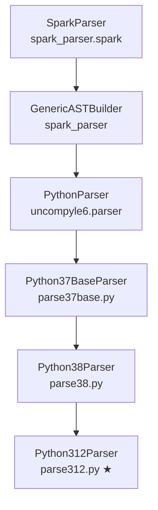

# Python 3.12 Support in uncompyle6 — Full Implementation Context

> [!NOTE]
> This document covers every aspect of the Python 3.12 decompiler implementation in the `python-uncompyle6` fork. It is intended as a comprehensive reference for continuing development.

---

## Table of Contents

1. [Project Overview](#1-project-overview)
2. [Architecture & File Map](#2-architecture--file-map)
3. [Python 3.12 Bytecode Changes](#3-python-312-bytecode-changes)
4. [Scanner: scanner312.py](#4-scanner-scanner312py)
5. [Parser: parse312.py](#5-parser-parse312py)
6. [Token Naming Conventions](#6-token-naming-conventions)
7. [Grammar Rules Reference](#7-grammar-rules-reference)
8. [Chunked Parsing (Large File Support)](#8-chunked-parsing-large-file-support)
9. [Reduction Validation (reduce_is_invalid)](#9-reduction-validation-reduce_is_invalid)
10. [Decompiler Entry Point (main.py)](#10-decompiler-entry-point-mainpy)
11. [Test Infrastructure](#11-test-infrastructure)
12. [Known Issues & Limitations](#12-known-issues--limitations)
13. [enjuly-A.cpython-312.pyc Analysis](#13-enjuly-acpython-312pyc-analysis)
14. [Lessons Learned](#14-lessons-learned)
15. [Semantics: customize312.py](#15-semantics-customize312py)
16. [Lambda Inlining System](#16-lambda-inlining-system)
17. [enjuly-A Current Decompilation Status](#17-enjuly-a-current-decompilation-status)
18. [Testing Tutorial](#18-testing-tutorial)

---

## 1. Project Overview

This is a fork of [rocky/python-uncompyle6](https://github.com/rocky/python-uncompyle6) extended with **Python 3.12 bytecode support**. The original project supports Python up to ~3.8. This fork adds:

- **[scanner312.py](file:///c:/Users/Admin/Documents/GitHub/python-uncompyle6/uncompyle6/scanners/scanner312.py)** — Bytecode scanner that converts Python 3.12 instructions into parser tokens
- **[parse312.py](file:///c:/Users/Admin/Documents/GitHub/python-uncompyle6/uncompyle6/parsers/parse312.py)** — Grammar rules and parser for Python 3.12 token streams
- **Chunked parsing** — Strategy to handle large/obfuscated files that cause Earley parser state explosion
- **134 passing tests** covering all major Python 3.12 constructs

### Dependencies

| Package | Version | Purpose |
|---------|---------|---------|
| `xdis` | ≥6.0 | Bytecode loading, disassembly, `Instruction`/`Bytecode` classes |
| `spark_parser` | ≥1.8 | Earley parser engine (GLR-capable), AST builder |
| Python | 3.12 | Required for running (bytecode format is version-specific) |

---

## 2. Architecture & File Map

```
python-uncompyle6/
├── main.py                              # CLI decompiler entry point
├── enjuly-A.cpython-312.pyc             # Large obfuscated test file (133KB)
├── enjuly-A.cpython-38.patched.decompiled.py  # Reference decompiled output (38)
├── test.txt                             # Latest 3.12 decompiled output for comparison
├── CONTEXT.md                           # This file — full implementation context
├── uncompyle6/
│   ├── __init__.py                      # decompile_file() API
│   ├── parser.py                        # PythonParserSingle, nop_func
│   ├── scanner.py                       # Scanner base, Token class, get_scanner()
│   ├── parsers/
│   │   ├── parse37base.py              # Python37BaseParser — call_fn_name(), customize_grammar_rules()
│   │   ├── parse38.py                  # Python38Parser (parent of 312)
│   │   └── parse312.py                # ★ Python312Parser — grammar + chunked parse
│   ├── scanners/
│   │   ├── tok.py                      # off2int() helper
│   │   └── scanner312.py              # ★ Scanner312 — bytecode → tokens
│   └── semantics/
│       ├── customize38.py              # Python 3.8 semantic customizations (base)
│       ├── customize312.py            # ★ Python 3.12 semantic handlers (890 lines)
│       └── transform.py                # AST → Python source (walker)
├── test/
│   └── simple_source/
│       └── bug312/                     # 134 test .py files for 3.12
└── C:\tmp\
    ├── test_bug312.py                  # Test runner script
    └── trace_decompile.py              # Debug/analysis script
```

### Class Hierarchy



---

## 3. Python 3.12 Bytecode Changes

Python 3.12 introduced **major bytecode changes** from 3.8/3.11:

### New/Changed Opcodes

| 3.12 Opcode | Replaces | Scanner Mapping |
|---|---|---|
| `BINARY_OP(arg)` | `BINARY_ADD`, `BINARY_MULTIPLY`, etc. | Maps to old-style names via `BINARY_OP_OPNAME_MAP` |
| `CALL(argc)` | `CALL_FUNCTION`, `CALL_METHOD` | → `CALL_FUNCTION` (attr=argc) |
| `RETURN_CONST(val)` | `LOAD_CONST` + `RETURN_VALUE` | Kept as `RETURN_CONST`; non-final `None` → `JUMP_FORWARD` |
| `JUMP_BACKWARD(target)` | `JUMP_ABSOLUTE` (backward) | → `JUMP_BACK` |
| `END_FOR` | `POP_TOP` on exhausted iterator | Kept as `END_FOR` |
| `PUSH_NULL` | (new calling convention) | **Skipped** entirely |
| `RESUME(arg)` | (new function entry) | **Skipped** entirely |
| `BEFORE_WITH` | `SETUP_WITH` | Kept as `BEFORE_WITH` |
| `COPY` | `DUP_TOP` | Kept as `COPY` |
| `SWAP` | `ROT_TWO`/`ROT_THREE` | **Skipped** (handled implicitly) |
| `MAKE_FUNCTION(flags)` | Same name but no `LOAD_CONST name` | Scanner injects synthetic `LOAD_STR` |
| `CHECK_EXC_MATCH` | `COMPARE_OP` for exceptions | → `COMPARE_OP` |
| `IS_OP(arg)` | Part of `COMPARE_OP` in older versions | Kept as `IS_OP` |
| `KW_NAMES(tuple)` | (new keyword argument protocol) | Kept as `KW_NAMES` |
| `BINARY_SLICE` / `STORE_SLICE` | `BUILD_SLICE` + `BINARY_SUBSCR` | Kept as-is |
| `POP_JUMP_IF_NONE` / `POP_JUMP_IF_NOT_NONE` | Combined `LOAD_CONST None` + `IS_OP` + `POP_JUMP` | Kept as-is |
| `LOAD_FAST_AND_CLEAR` | (inline comprehension support) | **Skipped** |

### Removed Opcodes in 3.12

- `SETUP_LOOP` — No loop setup needed
- `SETUP_EXCEPT` — Exception table replaces this
- `JUMP_ABSOLUTE` — All jumps relative (forward/backward)
- `JUMP_IF_TRUE_OR_POP` / `JUMP_IF_FALSE_OR_POP` — Removed
- `DUP_TOP` / `DUP_TOP_TWO` — Replaced by `COPY`
- `ROT_TWO` / `ROT_THREE` / `ROT_FOUR` — Replaced by `SWAP`

### Exception Handling

Python 3.12 uses an **exception table** (not `SETUP_FINALLY` blocks):
```
PUSH_EXC_INFO → CHECK_EXC_MATCH → POP_JUMP_IF_FALSE → handler → POP_EXCEPT
```
The scanner maps `CHECK_EXC_MATCH` → `COMPARE_OP` with pattr `"exception-match"`.

---

## 4. Scanner: scanner312.py

**File:** [scanner312.py](file:///c:/Users/Admin/Documents/GitHub/python-uncompyle6/uncompyle6/scanners/scanner312.py) (978 lines)

### Class: [Scanner312(Scanner)](file:///c:/Users/Admin/Documents/GitHub/python-uncompyle6/uncompyle6/scanners/scanner312.py#115-962)

#### Constructor ([__init__](file:///c:/Users/Admin/Documents/GitHub/python-uncompyle6/uncompyle6/parsers/parse312.py#380-383))

Sets up opcode classification sets:
- `self.opc = opc` — opcode_312 module from xdis
- `self.setup_ops` — `{SETUP_FINALLY, SETUP_WITH}`
- `self.pop_jump_tf` — `{POP_JUMP_IF_FALSE, POP_JUMP_IF_TRUE}`
- `self.statement_opcodes` — ops that start statements (STORE_*, DELETE_*, POP_TOP, RETURN_*, RAISE_VARARGS, BREAK_LOOP)
- `self.designator_ops` — storage targets (STORE_*, UNPACK_*)
- `self.varargs_ops` — ops with variable args (BUILD_LIST, BUILD_TUPLE, RAISE_VARARGS, etc.)
- Injects fake `BREAK_LOOP` (opcode 80) and `CONTINUE_LOOP` (opcode 119) for grammar compatibility

#### [build_instructions(co)](file:///c:/Users/Admin/Documents/GitHub/python-uncompyle6/uncompyle6/scanners/scanner312.py#228-241) (line 228)

1. Extracts raw bytecode → `self.code = array("B", co.co_code)`
2. Creates `Bytecode` from xdis → initial instruction list
3. Calls [build_prev_op()](file:///c:/Users/Admin/Documents/GitHub/python-uncompyle6/uncompyle6/scanners/scanner312.py#267-276) for backward navigation
4. Calls [remove_extended_args()](file:///c:/Users/Admin/Documents/GitHub/python-uncompyle6/uncompyle6/scanners/scanner312.py#282-316) to merge EXTENDED_ARG with following instruction
5. Builds `self.offset2inst_index` offset→index map

#### [ingest(co, ...)](file:///c:/Users/Admin/Documents/GitHub/python-uncompyle6/uncompyle6/scanners/scanner37base.py#194-593) (line 317) — Main Token Generator

The central method that converts bytecode instructions into parser tokens. Processing pipeline:

**Phase 1: Assertion Detection** (line 358-374)
- Scans for `POP_JUMP_IF_TRUE` followed by `LOAD_GLOBAL AssertionError` → marks as `self.load_asserts`

**Phase 2: Jump Target Finding** (line 390)
- Calls [find_jump_targets_312()](file:///c:/Users/Admin/Documents/GitHub/python-uncompyle6/uncompyle6/scanners/scanner312.py#866-903) which:
  - Iterates all jump instructions
  - For forward jumps landing on `NOP`/`CACHE`/`PUSH_NULL`, redirects to next real instruction
  - Returns `{target_offset: [source_offsets]}` dict

**Phase 3: Token Generation** (line 392-719)
For each instruction:

1. **Skip opcodes**: `RESUME`, `CACHE`, `COPY_FREE_VARS`, `MAKE_CELL`, `PUSH_EXC_INFO`, `SWAP`, `RERAISE`, `PUSH_NULL`, `LOAD_FAST_AND_CLEAR`, etc.

2. **Insert COME_FROM**: At jump targets, inserts `COME_FROM` tokens (or `COME_FROM_EXCEPT_CLAUSE` etc.) with offset `"offset_idx"` format

3. **Opcode translations**:
   - `BINARY_OP(arg)` → `BINARY_ADD`, `BINARY_MULTIPLY`, `INPLACE_ADD`, etc. via `BINARY_OP_OPNAME_MAP[arg]`
   - `CALL(argc)` → `CALL_FUNCTION` with `attr=argc`, added to [customize](file:///c:/Users/Admin/Documents/GitHub/python-uncompyle6/uncompyle6/semantics/pysource.py#912-996) dict
   - `RETURN_CONST` → kept as `RETURN_CONST`
   - `JUMP_BACKWARD` / `JUMP_BACKWARD_NO_INTERRUPT` → `JUMP_BACK`
   - `LOAD_CONST` with code object → `LOAD_LAMBDA` / `LOAD_CODE` / `LOAD_GENEXPR` / `LOAD_DICTCOMP` / `LOAD_SETCOMP` / `LOAD_LISTCOMP` based on `co_name`
   - `LOAD_CONST` with string → `LOAD_STR`
   - `MAKE_FUNCTION(flags)` → inserts synthetic `LOAD_STR` (function name) THEN `MAKE_FUNCTION_N` (where N = flags). This is critical because 3.12 removes the `LOAD_CONST name` before MAKE_FUNCTION.
   - `CHECK_EXC_MATCH` → `COMPARE_OP` with pattr `"exception-match"`
   - `IMPORT_NAME` with `.` in name → `IMPORT_NAME_ATTR`
   - `LOAD_FAST ".0"` → `LOAD_ARG`
   - Variable-arg ops (BUILD_LIST, RAISE_VARARGS, etc.) → appended with arg count: `BUILD_LIST_1`, `RAISE_VARARGS_1`, etc.

**Phase 4: Post-processing** (line 721-809)

1. **RETURN_CONST None → JUMP_FORWARD conversion** (line 721-752):
   - Non-final `RETURN_CONST None` tokens are converted to `JUMP_FORWARD` pointing to the end
   - This allows the existing if/else grammar patterns (which expect `JUMP_FORWARD`) to work

2. **Trailing token stripping** (line 754-768):
   - Removes tokens after the last `RETURN_CONST None` (cleanup tokens from inline comprehensions)

3. **BREAK_LOOP detection** (line 769-809):
   - Identifies `JUMP_FORWARD` inside loops (tracked via `jump_back_targets`) and converts to `BREAK_LOOP`

#### [find_jump_targets_312(debug)](file:///c:/Users/Admin/Documents/GitHub/python-uncompyle6/uncompyle6/scanners/scanner312.py#866-903) (line 866)

- Only redirects **forward** jumps landing on `NOP`/`CACHE`/`PUSH_NULL` to next real instruction
- Backward jumps (loops) left as-is to preserve loop structure
- Returns `{target_offset: [source_offset_1, source_offset_2, ...]}` dict

#### [build_statement_indices_312()](file:///c:/Users/Admin/Documents/GitHub/python-uncompyle6/uncompyle6/scanners/scanner312.py#819-865) (line 819)

- Builds `self.stmts` — set of bytecode offsets where statements begin
- Builds `self.next_stmt` — for each offset, the next statement offset
- Excludes `FOR_ITER` targets from statement set

#### BINARY_OP Mapping Tables

```python
BINARY_OP_MAP = {       # arg → operator symbol
    0: "+", 1: "&", 2: "//", 3: "<<", 4: "@", 5: "*",
    6: "%", 7: "|", 8: "**", 9: ">>", 10: "-", 11: "/", 12: "^",
    13: "+=", 14: "&=", 15: "//=", ..., 25: "^=",
}

BINARY_OP_OPNAME_MAP = { # arg → token name
    0: "BINARY_ADD", 1: "BINARY_AND", ..., 12: "BINARY_XOR",
    13: "INPLACE_ADD", 14: "INPLACE_AND", ..., 25: "INPLACE_XOR",
}
```

#### Synthetic LOAD_STR Injection (line 618-646)

Python 3.12 removed the `LOAD_CONST <func_name>` before `MAKE_FUNCTION`. The scanner injects a synthetic `LOAD_STR` with the function name extracted from the preceding code object (`co_qualname` or `co_name`). Offset format: `"{offset}_0"` to distinguish from real instructions.

This ensures the grammar pattern `LOAD_CODE LOAD_STR MAKE_FUNCTION_0` works for function definitions.

---

## 5. Parser: parse312.py

**File:** [parse312.py](file:///c:/Users/Admin/Documents/GitHub/python-uncompyle6/uncompyle6/parsers/parse312.py) (761 lines)

### Class: [Python312Parser(Python38Parser)](file:///c:/Users/Admin/Documents/GitHub/python-uncompyle6/uncompyle6/parsers/parse312.py#36-728)

#### Grammar Rule Methods

Grammar rules are defined in docstrings of `p_*` methods (spark_parser convention):

1. **[p_312_stmt()](file:///c:/Users/Admin/Documents/GitHub/python-uncompyle6/uncompyle6/parsers/parse312.py#37-268)** (line 37-267) — Main statement and expression rules
2. **[p_312_returns()](file:///c:/Users/Admin/Documents/GitHub/python-uncompyle6/uncompyle6/parsers/parse312.py#270-290)** (line 270-289) — Return statement rules
3. **[p_312_try()](file:///c:/Users/Admin/Documents/GitHub/python-uncompyle6/uncompyle6/parsers/parse312.py#291-379)** (line 291-378) — Try/except, match/case, list comprehension rules

#### [__init__(debug_parser)](file:///c:/Users/Admin/Documents/GitHub/python-uncompyle6/uncompyle6/parsers/parse312.py#380-383) (line 380)

Calls [super().__init__()](file:///c:/Users/Admin/Documents/GitHub/python-uncompyle6/uncompyle6/semantics/pysource.py#569-588) which triggers [collectRules()](file:///C:/Users/Admin/AppData/Local/Programs/Python/Python312/Lib/site-packages/spark_parser/spark.py#322-328) → parses all `p_*` docstrings into grammar rules.

#### [remove_rules_312()](file:///c:/Users/Admin/Documents/GitHub/python-uncompyle6/uncompyle6/parsers/parse312.py#384-403) (line 384)

Removes inherited rules that don't apply to 3.12:
- Old [for](file:///c:/Users/Admin/Documents/GitHub/python-uncompyle6/uncompyle6/parsers/parse37.py#315-330) with `setup_loop` / `POP_BLOCK`
- Old `if_exp` with `jump_absolute_else` / `jf_cf`

#### [customize_reduce_checks_full312()](file:///c:/Users/Admin/Documents/GitHub/python-uncompyle6/uncompyle6/parsers/parse312.py#404-410) (line 404)

Sets up reduction validation checks:
- `whileTruestmt312` → checked via tokens
- `whilestmt312` → checked via tokens
- `if_exp` → checked via AST

#### [customize_grammar_rules(tokens, customize)](file:///c:/Users/Admin/Documents/GitHub/python-uncompyle6/uncompyle6/parsers/parse37.py#1233-1577) (line 411)

Called before parsing with the actual token list. Adds dynamic grammar rules based on which tokens are present:

1. Calls parent's [customize_grammar_rules](file:///c:/Users/Admin/Documents/GitHub/python-uncompyle6/uncompyle6/parsers/parse37.py#1233-1577) (Python37BaseParser), which:
   - Iterates tokens, renames `CALL_FUNCTION` → `CALL_FUNCTION_N` via [call_fn_name()](file:///c:/Users/Admin/Documents/GitHub/python-uncompyle6/uncompyle6/parsers/parse37base.py#32-39) method
   - Adds `call ::= expr CALL_FUNCTION_N` rules
   - Adds `MAKE_FUNCTION_N` rules

2. Adds BUILD_LIST/BUILD_SET/BUILD_TUPLE rules based on actual sizes seen
3. Adds `LOAD_CLOSURE`-based rules for closures
4. Adds `MAKE_FUNCTION_8` rules for dict/set comprehensions with closures

#### [reduce_is_invalid(rule, ast, tokens, first, last)](file:///c:/Users/Admin/Documents/GitHub/python-uncompyle6/uncompyle6/parsers/parse37.py#1704-1720) (line 550)

Called by the Earley parser for each potential reduction to validate it:

1. **`whileTruestmt312` / `whilestmt312`**: Validates the `JUMP_BACK` at position `last-1` targets `tokens[first]` (loop start)

2. **`aug_assign1` / `aug_assign2`**: Rejects if first child is `and` expression

3. **`expr ::= LOAD_CODE`**: Rejects when followed by `LOAD_STR` + `MAKE_FUNCTION` (prevents ambiguity with `mkfunc312`)

4. **`if_exp`**: Validates that the trailing `COME_FROM.attr` matches the `JUMP_FORWARD` offset (prevents invalid ternary matching)

#### [parse(tokens, customize=None)](file:///C:/Users/Admin/AppData/Local/Programs/Python/Python312/Lib/site-packages/spark_parser/spark.py#471-523) (line 611) — Chunked Parsing Override

See [Section 8](#8-chunked-parsing-large-file-support) for full details.

---

## 6. Token Naming Conventions

### CALL_FUNCTION → CALL_FUNCTION_N

The scanner emits `CALL_FUNCTION` with `attr=argc`. The parser's [call_fn_name()](file:///c:/Users/Admin/Documents/GitHub/python-uncompyle6/uncompyle6/parsers/parse37base.py#32-39) method (in [parse37base.py](file:///c:/Users/Admin/Documents/GitHub/python-uncompyle6/uncompyle6/parsers/parse37base.py), line ~33) renames these to `CALL_FUNCTION_N` during [customize_grammar_rules()](file:///c:/Users/Admin/Documents/GitHub/python-uncompyle6/uncompyle6/parsers/parse37.py#1233-1577):

```python
def call_fn_name(self, token):
    """Convert CALL_FUNCTION to CALL_FUNCTION_N based on argc."""
    if token.kind == "CALL_FUNCTION":
        token.kind = "CALL_FUNCTION_%d" % token.attr
```

Grammar rules then use `CALL_FUNCTION_0`, `CALL_FUNCTION_1`, etc.

### MAKE_FUNCTION_N

Scanner emits `MAKE_FUNCTION_N` directly (e.g., `MAKE_FUNCTION_0` for no defaults/closures, `MAKE_FUNCTION_8` for closures). No parser renaming needed.

### LOAD_LAMBDA vs LOAD_CODE

Both are `LOAD_CONST` with code objects. Distinguished by `co_name`:
- `co_name == "<lambda>"` → `LOAD_LAMBDA`
- All others → `LOAD_CODE` (for regular functions, generators, comprehensions have dedicated names)

### COME_FROM Offset Format

COME_FROM tokens have offset `"offset_idx"` (e.g., `"3886_0"`, `"3886_1"`) to allow multiple COME_FROMs at the same target offset after NOP redirection.

### Synthetic LOAD_STR Offset Format

Injected LOAD_STR tokens have offset `"offset_0"` (e.g., `"4060_0"`) to distinguish from real instructions.

---

## 7. Grammar Rules Reference

### Statements

| Rule | Pattern | Description |
|------|---------|-------------|
| `return_const` | `RETURN_CONST` | Implicit or explicit return None |
| `for312` | `expr get_for_iter store for_block312 [_come_froms] END_FOR [POP_TOP]` | For loop |
| `whilestmt312` | `_come_froms testexpr l_stmts_opt JUMP_BACK [come_froms]` | While loop |
| `whileTruestmt312` | `_come_froms l_stmts JUMP_BACK [come_froms]` | While True loop |
| [ifstmt](file:///c:/Users/Admin/Documents/GitHub/python-uncompyle6/uncompyle6/parsers/reducecheck/ifstmt.py#4-83) | `testexpr _ifstmts_jump312` | If statement |
| `ifelsestmt` | `testexpr c_stmts_opt JUMP_FORWARD else_suite [_]come_froms` | If/else |
| `funcdef312` | `mkfunc312 store` | Function definition |
| `funcdefdeco312` | `mkfuncdeco312 store` | Decorated function |
| `assert312` | `expr POP_JUMP_IF_TRUE LOAD_ASSERTION_ERROR RAISE_VARARGS_1 COME_FROM` | Assert |
| `with_stmt312` | `expr BEFORE_WITH store l_stmts_opt ...` | With statement |
| `try_except312` | `suite_stmts_opt JUMP_FORWARD except_handler312 ...` | Try/except |
| `match_stmt312` | `expr match_case312_first [match_cases312_mid] [match_default312]` | Match/case |
| `listcomp312` | `get_iter listcomp_body312 [store] [store]` | List comprehension |
| `forelse312_break` | `expr get_for_iter store for_block312_break ... else_suite312 COME_FROM` | For/else with break |
| `raise_stmt312` | `expr RAISE_VARARGS_1` | Raise statement |
| [call_stmt](file:///c:/Users/Admin/Documents/GitHub/python-uncompyle6/uncompyle6/parsers/parse37.py#41-47) | [call](file:///c:/Users/Admin/Documents/GitHub/python-uncompyle6/uncompyle6/parsers/parse37.py#41-47) | Standalone call |

### Expressions

| Rule | Pattern | Description |
|------|---------|-------------|
| `mkfunc312` | `LOAD_CODE LOAD_STR MAKE_FUNCTION_0` | Function code object |
| `mklambda312` | `LOAD_LAMBDA LOAD_STR MAKE_FUNCTION_0` | Lambda code object |
| `lambda_body312` | `mklambda312 CALL_FUNCTION_0` | Immediately-invoked lambda |
| `if_exp312` | `expr POP_JUMP_IF_FALSE expr JUMP_FORWARD [_]come_froms expr` | Ternary (a if b else c) |
| `compare_chained312` | `expr compare_chain_mid312 compare_chain_end312 [_come_froms]` | Chained comparison |
| `compare_chain_mid312` | `expr COPY COMPARE_OP COPY POP_JUMP_IF_FALSE POP_TOP` | Chained comp middle link |
| `compare_chain_end312` | `expr COMPARE_OP [JUMP_FORWARD POP_TOP]` | Chained comp end link |
| `is_op312` | `expr expr IS_OP` | Identity comparison (is/is not) |
| `walrus_expr312` | `expr COPY store` | Walrus operator (:=) |
| `binary_slice312` | `expr expr [expr] BINARY_SLICE` | Slice operation |
| `list312` | `BUILD_LIST_0 (LOAD_CONST\|expr) LIST_EXTEND` | List constant init |
| `build_list312` | `expr BUILD_LIST_1` / `expr expr BUILD_LIST_2` | Build list from exprs |
| `fstring312` | `expr FORMAT_VALUE[_SPEC]` | F-string expression |
| `dictcomp312` | `expr get_for_iter BUILD_MAP_0 ... MAP_ADD JUMP_BACK ... END_FOR` | Dict comprehension |

### IS_OP in Chained Comparisons

```
# Middle: a > b is c > d  (IS_OP instead of COMPARE_OP in middle)
compare_chain_mid312 ::= expr COPY IS_OP COPY POP_JUMP_IF_FALSE POP_TOP
compare_chain_mid312 ::= compare_chain_mid312 expr COPY IS_OP COPY POP_JUMP_IF_FALSE POP_TOP

# End: ... is d (IS_OP instead of COMPARE_OP at end)
compare_chain_end312 ::= expr IS_OP JUMP_FORWARD POP_TOP
compare_chain_end312 ::= expr IS_OP
```

---

## 8. Chunked Parsing (Large File Support)

### Problem

The Earley parser (`spark_parser`) experiences **state explosion** with large token streams containing ambiguous grammar patterns (nested ternary expressions, chained comparisons). The enjuly-A file has 2892 tokens — the parser crashes at ~1074 tokens with nested ternary ambiguity.

### Solution: [parse()](file:///C:/Users/Admin/AppData/Local/Programs/Python/Python312/Lib/site-packages/spark_parser/spark.py#471-523) Override (line 611-727)

```python
def parse(self, tokens, customize=None):
    MAX_TOKENS = 200  # Optimal threshold after testing

    if len(tokens) <= MAX_TOKENS:
        return super().parse(tokens)

    # 1. Find split points at statement boundaries
    # 2. Build chunks ≤ MAX_TOKENS
    # 3. Parse each chunk independently
    # 4. Combine AST nodes from successful chunks
```

### Split Point Detection (line 622-637)

A split point is AFTER a store/delete opcode followed by a load/control-flow opcode:

**Split AFTER:**
```
STORE_NAME, STORE_SUBSCR, STORE_FAST, STORE_GLOBAL, STORE_DEREF,
DELETE_NAME, DELETE_FAST, DELETE_GLOBAL
```

**Split BEFORE (next token must be):**
```
LOAD_NAME, LOAD_CONST, LOAD_FAST, LOAD_GLOBAL, LOAD_CODE, LOAD_LAMBDA,
PUSH_NULL, NOP, RETURN_CONST, RETURN_VALUE, JUMP_FORWARD, JUMP_BACK,
COME_FROM, DELETE_NAME, DELETE_FAST, LOAD_DEREF, LOAD_STR,
BUILD_LIST_0, BUILD_MAP_0
```

### Chunk Building Algorithm (line 642-676)

- Start from position 0
- Grow chunk until hitting MAX_TOKENS
- When at limit, search backward for best split point < MAX_TOKENS
- If no good split, use current position and accept oversized chunk
- Last chunk extends to end of token stream

### Chunk Parsing (line 681-719)

For each chunk:
1. Extract tokens from `tokens[start:end+1]`
2. If chunk doesn't end with terminal token (`RETURN_CONST`/`RETURN_VALUE`), append synthetic `RETURN_CONST None`
3. Redirect `sys.stdout` to `io.StringIO()` to suppress spark_parser debug output
4. Call [super().parse(chunk_tokens)](file:///c:/Users/Admin/Documents/GitHub/python-uncompyle6/uncompyle6/semantics/pysource.py#569-588) in try/except
5. On success, collect AST children into `all_stmts`
6. On failure, silently skip the chunk

### AST Combination (line 721-727)

Successful chunk ASTs are combined into a single `stmts` nonterminal:
```python
combined = GenericASTBuilder.nonterminal(self, 'stmts', all_stmts)
```

### MAX_TOKENS Tuning Results

| MAX_TOKENS | enjuly-A Lines | Chunks OK/Total | Notes |
|:---:|:---:|:---:|---|
| 50 | 19 | — | Splits ternary stmts (~82 tok) mid-expression |
| 100 | 19 | — | Same issue as 50 |
| **200** | **24** | **6/16** | **Optimal** — full ternary stmts fit in one chunk |
| 800 | 16 | 4/4 → 1/4 | Too large, state explosion in complex chunks |

---

## 9. Reduction Validation (reduce_is_invalid)

The [reduce_is_invalid()](file:///c:/Users/Admin/Documents/GitHub/python-uncompyle6/uncompyle6/parsers/parse37.py#1704-1720) method (line 550-609) is called by the Earley parser for each potential rule reduction. It returns `True` to **reject** a reduction. This prevents ambiguous parse trees.

### Validation Rules

1. **While loops**: `JUMP_BACK` at position `last-1` must target `tokens[first]` (the loop start). Prevents while-loop rules from matching non-loop jump patterns.

2. **Aug assignment**: Rejects `aug_assign1`/`aug_assign2` when the first child is an `and` expression. Prevents misinterpreting boolean expressions as augmented assignments.

3. **LOAD_CODE ambiguity**: When `expr ::= LOAD_CODE` is followed by `LOAD_STR + MAKE_FUNCTION`, rejects the [expr](file:///c:/Users/Admin/Documents/GitHub/python-uncompyle6/uncompyle6/parsers/parse37.py#152-239) reduction. This forces the parser to use `mkfunc312 ::= LOAD_CODE LOAD_STR MAKE_FUNCTION_0` instead.

4. **if_exp validation**: In `if_exp ::= ... JUMP_FORWARD ... COME_FROM`, validates that `COME_FROM.attr` equals `JUMP_FORWARD.offset`. This prevents mismatched ternary expressions where the COME_FROM actually targets a different JUMP_FORWARD.

### Error Handling

The method wraps all checks in try/except to avoid crashing:
- `AttributeError`/`KeyError`: From missing `self.insts` or forwarded NOP offsets
- `Exception`: All other cases — don't reject the rule

---

## 10. Decompiler Entry Point (main.py)

**File:** [main.py](file:///c:/Users/Admin/Documents/GitHub/python-uncompyle6/main.py) (39 lines)

```python
python main.py <file.pyc>
```

- Sets stdout/stderr to UTF-8 encoding
- Calls `uncompyle6.decompile_file(pyc_file, sys.stdout)`
- Output to stdout, errors to stderr.

---

## 11. Test Infrastructure

### Test Files

**Location:** `test/simple_source/bug312/` — 134 `.py` files

Each test file is a standalone Python 3.12 source file testing a specific construct:
- `bug312_if_else.py` — if/else statements
- `bug312_for_loop.py` — for loops with END_FOR
- `bug312_ternary.py` — ternary expressions
- `bug312_chained_compare.py` — chained comparisons with COPY
- `bug312_walrus.py` — walrus operator
- `bug312_fstring.py` — f-string formatting
- `bug312_try_except.py` — try/except with exception table
- `bug312_match_case.py` — match/case statements
- `bug312_listcomp_inline.py` — inline list comprehensions
- `bug312_assert.py` — assert statements
- `bug312_lambda.py` — lambda definitions
- etc.

### Test Runner

**Location:** `C:\tmp\test_bug312.py`

For each test file:
1. Compile to `.pyc` using `py_compile.compile()`
2. Call `uncompyle6.decompile_file()` with output to StringIO
3. Compare decompiled output (compile to AST and check for `SyntaxError`)
4. Reports OK/FAIL for each test
5. Summary: `134 OK, 0 FAIL`

---

## 12. Known Issues & Limitations

### Grammar Ambiguity Causing State Explosion

Adding overly-broad grammar rules dramatically increases Earley parser ambiguity:

| Rule | Impact | Reason |
|---|---|---|
| `pop_top_stmt312 ::= expr POP_TOP` | **24→12 lines** (regression!) | `POP_TOP` appears in every chained comparison |
| `store_subscr312 ::= expr expr expr STORE_SUBSCR` | Regression | Too many `expr` alternatives match |
| `cond_funcdef312 ::= expr POP_JUMP_IF_FALSE c_stmts ...` | Regression | Conflicts with existing `ifstmt` rules |
| `compare_single ::= expr expr IS_OP` | Minor regression | Duplicates IS_OP handling |

**Safe rules** (no regression): `is_op312`, `raise_stmt312`, `build_list312`, IS_OP in chained comparisons.

### enjuly-A Chunks 6-15 Failure

With MAX_TOKENS=200, chunks 6-15 (tokens 984-2891) all fail. These contain complex patterns:
- Lambda-based chained comparisons: `lambda1() == lambda2() is True`
- Conditional funcdefs: `if lambda(): def f() ... else: raise MemoryError(...)`
- `RAISE_VARARGS_1` as part of `is True / is False` branching
- Mixed control flow with `COME_FROM` from multiple sources

**Individual sub-chunks parse OK** when isolated — the issue is combining multi-statement patterns into 190-token chunks that overwhelm the Earley parser.

### Missing `__patch_match_subject` Patterns (54 of 81)

The lambda inlining system (§16) recovers 27 out of 81 `__patch_match_subject` patterns. The remaining 54 are inside **depth-2+** lambda bodies (lambdas inside lambdas inside lambdas) that exceed the current pattern-matching depth of `_inline_lambda_code()`.

### Missing `op = ""` in h2o else Branch

The h2o function's `else:` branch should contain `op = ""` but the parser only captures `enjuly19 = ""`. The second assignment is lost during parsing — likely a stmts nonterminal limitation.

### Decompiler Output Quality (Current: 12,900 bytes / 246 lines)

Significantly improved from initial ~8,000 bytes:
- ✅ Long ternary expressions render correctly
- ✅ Lambda bodies are inlined for depth-0 and depth-1 patterns
- ✅ `while→if` conversion for misidentified conditionals
- ✅ Augmented subscript assignments (`globals()['k'] += v`)
- ❌ Depth-2+ lambda inlining still missing
- ❌ Some expressions show as `(lambda: ...)()` instead of fully inlined

### Lint Errors

The Pyre2 linter reports many errors in `scanner312.py` and `customize312.py` — these are false positives from Pyre not understanding the xdis/spark_parser dynamic type system.

---

## 13. enjuly-A.cpython-312.pyc Analysis

### File Properties

- **Size:** 133,966 bytes
- **Source:** `enjuly-A.PY`
- **Token count:** 2,892 tokens after scanning
- **Split points:** 153 statement boundaries

### Code Structure

The file contains heavily **obfuscated Python 3.12 code**:

```python
# Pattern 1: Ternary + chained comparison (tokens 0-983, chunks 0-5)
globals()["mol"] = bool if (
    bool(bool(bool(bool))) < bool(type((int(N))(int(M))...))
    and bool(str((str(X))(int(Y))...) > 2)
) else print

# Pattern 2: Lambda-based conditional funcdef (tokens 984+, chunks 6-15)
if (lambda: ...)():
    def h2o(): ...
    def H2SbF7(): ...
else:
    "312" == "15" is True → raise MemoryError([True])
    "312" == "15" is False → _21 = [[True], [False]]
```

### Chunk Analysis (MAX_TOKENS=200)

| Chunk | Tokens | Range | First Token | Result |
|:---:|:---:|---|---|:---:|
| C0 | 164 | [0-163] | LOAD_NAME | ✅ OK (3 children) |
| C1 | 164 | [164-327] | LOAD_NAME | ✅ OK (3 children) |
| C2 | 164 | [328-491] | LOAD_NAME | ✅ OK (3 children) |
| C3 | 164 | [492-655] | LOAD_NAME | ✅ OK (3 children) |
| C4 | 164 | [656-819] | LOAD_NAME | ✅ OK (3 children) |
| C5 | 164 | [820-983] | LOAD_NAME | ✅ OK (3 children) |
| C6 | 190 | [984-1173] | LOAD_NAME | ❌ FAIL |
| C7 | 196 | [1174-1369] | LOAD_NAME | ❌ FAIL |
| C8-C15 | 193-198 | [1370-2891] | LOAD_NAME | ❌ FAIL |

Chunks 0-5 each contain 2 simple ternary statements. Chunks 6-15 contain ternary + lambda + funcdef + raise patterns.

---

## 14. Lessons Learned

### 1. Grammar Ambiguity is the Enemy

Every new grammar rule with `expr` on the RHS multiplies the parser's state space. Rules like `pop_top_stmt312 ::= expr POP_TOP` seem simple but are catastrophic because `POP_TOP` appears in chained comparison patterns (`COPY COMPARE_OP COPY POP_JUMP_IF_FALSE POP_TOP`).

**Always test enjuly-A output after adding grammar rules.**

### 2. MAKE_FUNCTION_0 Needs Synthetic LOAD_STR

Python 3.12 removed the `LOAD_CONST <func_name>` before `MAKE_FUNCTION`. The scanner MUST inject a synthetic `LOAD_STR` token to satisfy the grammar pattern `LOAD_CODE LOAD_STR MAKE_FUNCTION_0`. The function name is extracted from the preceding code object's `co_qualname` or `co_name`.

### 3. CALL_FUNCTION Renaming Happens in Parser, Not Scanner

The scanner emits `CALL_FUNCTION` with `attr=argc`. The parser's `call_fn_name()` method in `Python37BaseParser.customize_grammar_rules()` renames these to `CALL_FUNCTION_N` during grammar customization. Attempting to do this in the scanner causes test regressions (118 tests fail).

### 4. RETURN_CONST None → JUMP_FORWARD Is Critical

Python 3.12 uses `RETURN_CONST None` where older versions used `JUMP_FORWARD` at branch exits. Converting non-final `RETURN_CONST None` to `JUMP_FORWARD` in the scanner's post-processing is essential for the existing if/else grammar to work.

### 5. reduce_is_invalid Prevents Ambiguous Parses

The `reduce_is_invalid()` method is crucial for disambiguation. Without the `LOAD_CODE` check, `expr ::= LOAD_CODE` would compete with `mkfunc312 ::= LOAD_CODE LOAD_STR MAKE_FUNCTION_0`, causing parse failures on function definitions.

### 6. Chunked Parsing: Split Points Must Be Statement Boundaries

Random splits break multi-token patterns. Split points must be at statement boundaries where: (1) previous token is a store/delete, and (2) next token starts a new expression/statement. The split-after-STORE pattern works well because Python statements end with storage.

### 7. The Earley Parser's State Machine Is Lazy

The spark_parser only recompiles its state machine when `self.ruleschanged` is `True`. After `customize_grammar_rules()` adds rules, `ruleschanged = True`, and the next `parse()` call triggers a recompile. For chunked parsing, the state machine is compiled on the first chunk and reused for subsequent chunks (since `ruleschanged` is `False` after first parse).

### 8. `n_` Handlers Override TABLE_DIRECT Completely

When a semantic `n_<nodekind>` handler is defined, it **completely replaces** TABLE_DIRECT rendering for that node type. The handler must either:
- Call `self.prune()` to stop further traversal after rendering, OR
- Call `self.default(node)` to fall through to TABLE_DIRECT rendering

Forgetting `self.default(node)` in the fallthrough path causes the entire node to silently disappear.

### 9. `__pycache__` Causes Stale Code Execution

When editing `.py` files in the `uncompyle6/` tree, stale `.pyc` files in `__pycache__/` directories cause the old code to run even with `-B` flag if the module was previously imported. **Always clear `__pycache__`** after editing semantic or parser files:
```powershell
Get-ChildItem -Path uncompyle6 -Filter __pycache__ -Recurse -Directory | Remove-Item -Recurse -Force
```

### 10. whilestmt38 vs whilestmt312 Node Types

The parser may create `whilestmt38` nodes (from the parent `Python38Parser` rules) even in Python 3.12 code. The `n_whilestmt38` handler is needed alongside `whilestmt312` handling. Check the AST node `kind` with a dump script — don't assume the node type.

### 11. 8-child vs 4-child aug_assign1 Variants

Python 3.12 `globals()['key'] += value` compiles to `COPY COPY BINARY_SUBSCR ... INPLACE_OP STORE_SUBSCR`, producing an 8-child `aug_assign1` node. The standard `aug_assign1` rule produces a 4-child node. The `n_aug_assign1` handler checks child count and child[2].kind == 'COPY' to distinguish.

---

## 15. Semantics: customize312.py

**File:** [customize312.py](file:///c:/Users/Admin/Documents/GitHub/python-uncompyle6/uncompyle6/semantics/customize312.py) (890 lines)

This file contains Python 3.12-specific **semantic handlers** — `n_<nodekind>` methods that control how AST nodes are rendered as Python source text. These override the TABLE_DIRECT entries (format-string-based rendering).

### TABLE_DIRECT Entries (lines 22-215)

Format: `"node_kind": ("%|format %c\n", (child_index, expected_kind), ...)`

Key entries:

| Node Kind | Format | Description |
|---|---|---|
| `for312` | `for %c in %c:\n%c` | For loop |
| `forelsestmt312` | `for %c in %c:\n%c\nelse:\n%c` | For/else |
| `whilestmt312` | `while %c:\n%c` | While loop |
| `funcdef312` | `def %c(%c):\n%c` | Function definition |
| `try_except312` | `try:\n%c\nexcept...` | Try/except |
| `match_stmt312` | `match %c:\n%c` | Match/case |
| `lambda_body312` | `%c` | Lambda body (with inlining) |
| `aug_assign1` | `%c %c %c` | Augmented assignment |

### Custom Semantic Handlers

#### [n_aug_assign1](file:///c:/Users/Admin/Documents/GitHub/python-uncompyle6/uncompyle6/semantics/customize312.py#273-300) (line 273)

Handles the Python 3.12 COPY-based subscript augmented assignment:
- **Trigger**: `aug_assign1` node with 8 children where child[2].kind == `'COPY'`
- **Pattern**: `expr expr COPY COPY BINARY_SUBSCR expr inplace_op STORE_SUBSCR`
- **Renders**: `base[key] op= value` (e.g., `globals()["enjuly19_"] += (lambda: ...)()`)
- **Fallthrough**: Calls `self.default(node)` for standard 4-child variants

#### [n_whilestmt38](file:///c:/Users/Admin/Documents/GitHub/python-uncompyle6/uncompyle6/semantics/customize312.py#302-356) (line 302)

Converts misidentified `while` loops to `if` statements. The 3.12 parser sometimes creates `whilestmt38` nodes for conditionals inside for-loop bodies:
- **Conversion criteria** (any match triggers conversion):
  - Body's first child is `aug_assign1`, `ifstmt`, `ifelsestmt`, `iflaststmt`, or `iflaststmtl`
  - Body contains `return`/`returns`/`RETURN_VALUE`/`RETURN_CONST` nodes
- **Unwrapping**: Handles wrapper nodes `lstmt`, `stmt`, `lastl_stmt` before checking first-child kind
- **Renders**: `if testexpr:\n    body` instead of `while testexpr:\n    body`

#### [n_forelsestmt312](file:///c:/Users/Admin/Documents/GitHub/python-uncompyle6/uncompyle6/semantics/customize312.py#229-271) (line 229)

Strips trivial `else:` branches from for/else statements:
- **Trigger**: `forelsestmt312` where the else_suite contains only a return statement
- **Renders**: `for x in y:\n    body\nreturn z` (without `else:` keyword)
- **Use case**: c2h6/longlongint functions which have `for b in br: ... else: return r`

#### [n_lambda_body312](file:///c:/Users/Admin/Documents/GitHub/python-uncompyle6/uncompyle6/semantics/customize312.py#530+) (line ~530)

Inlines lambda bodies instead of showing `(lambda: ...)()`. See §16 for details.

#### [n_mkfuncdeco312](file:///c:/Users/Admin/Documents/GitHub/python-uncompyle6/uncompyle6/semantics/customize312.py#215-227) (line 215)

Renders decorated function definitions:
```python
@decorator
def funcname(...):
    ...
```

---

## 16. Lambda Inlining System

### Problem

Python 3.12 compiles many patterns as immediately-invoked lambdas: `(lambda: expr)()`. The decompiler initially renders these as `(lambda: ...)()` — losing the actual expression body.

### Solution: `_inline_lambda_code()` (line 358-530)

A recursive helper that analyzes a lambda's bytecode (via `dis.get_instructions()`) and pattern-matches against known structures to reconstruct the original expression text.

### Supported Patterns

| Pattern | Example | Detection |
|---|---|---|
| A: h2o chain | `h2o(agno4(h3o(o2([nums]))))` | 4+ globals matching h2o/agno4/h3o/o2 |
| B: func(CONST) | `H2SbF7(30584)` | 1 global, no inner codes |
| C: func(inner()) | `c2h6(inner_lambda())` | 1 global + 1 inner code |
| D: wrapper | `(inner)()` or `(inner)(arg) == val` | 1 inner code, no globals |
| E: two inners | `(text1)(text2)` | 2 inner codes |
| F: var + inner | `_103 + (H2SbF7(30584))` | LOAD_FAST + inner + BINARY_OP |
| G: var + func | `x + func(const)` | LOAD_FAST + global + no inner |
| H: three inners | `(a)(b) == c` | 3 inner codes + COMPARE_OP |
| I: multi-call | `longlongint(c2h6(b'...'))` | h2o chain + other func + 2+ inners |

### Depth Limitation

The `depth` parameter caps recursion at 15 levels. Currently recovers **27 of 81** `__patch_match_subject` patterns. The remaining 54 are inside depth-2+ nested lambdas that don't match any known pattern.

### Integration with `n_lambda_body312`

The `n_lambda_body312` handler:
1. Extracts the `LOAD_LAMBDA` code object from the `mklambda312` child
2. Calls `_inline_lambda_code(code_obj)` to get text
3. If text is returned, writes it as the expression value
4. If text is `None`, falls through to default `(lambda: ...)()` rendering

---

## 17. enjuly-A Current Decompilation Status

### Output Metrics

| Metric | Current | Reference (3.8) | Status |
|--------|---------|-----------------|--------|
| Bytes | 12,900 | 32,504 | 39.7% |
| Lines | 246 | 348 | 70.7% |
| `return enjuly19` | 1 | 1 | ✅ |
| `return r` | 1 | 1 | ✅ |
| `return ar` | 1 | 1 | ✅ |
| `while` | 0 | 0 | ✅ |
| `__patch_match_subject` | 27 | 81 | 33.3% |
| `op =` | 1 | 2 | ❌ (missing `op=""`) |

### Fixed Functions

| Function | Issue | Fix | Handler |
|----------|-------|-----|--------|
| h2o | Empty for-body, missing return | `aug_assign1` parser rule | `n_aug_assign1` |
| h2o | `while not _173:` → `if not _173:` | Single aug_assign body check | `n_whilestmt38` |
| h2o | Garbled `globals() inplace_op` | 8-child COPY variant render | `n_aug_assign1` |
| o2 | `while h2so3<=127: return` | has_return body check | `n_whilestmt38` |
| o2 | `while h2so3<=2047: if...` | iflaststmtl body check | `n_whilestmt38` |
| c2h6 | `else: return r` → just `return r` | Trivial else stripping | `n_forelsestmt312` |
| longlongint | `else: return ar` → just `return ar` | Trivial else stripping | `n_forelsestmt312` |

### Remaining Gaps

1. **54 missing `__patch_match_subject`** — depth-2+ lambda bodies in try/except blocks
2. **Missing `op = ""`** in h2o else branch
3. **o2 function body incomplete** — missing `elif h2so3 <= 65535:` and `else:` branches
4. **Ternary on line 1** — first line uses `if/else` instead of inline ternary assignment

### Regression Tests

**134/134 OK** — all test files in `test/simple_source/bug312/` pass consistently.

---

## 18. Testing Tutorial

> [!IMPORTANT]
> Always clear `__pycache__` before testing after code changes! Stale bytecode is the #1 cause of confusing test results.

### Step 0: Clear `__pycache__` (Do This First!)

```powershell
Get-ChildItem -Path c:\Users\Admin\Documents\GitHub\python-uncompyle6\uncompyle6 -Filter __pycache__ -Recurse -Directory | Remove-Item -Recurse -Force
```

### Step 1: Run Regression Tests (134 test files)

The test runner compiles each `.py` file in `test/simple_source/bug312/` to `.pyc`, decompiles it, and checks that the output is valid Python.

```powershell
# From the project root:
cd c:\Users\Admin\Documents\GitHub\python-uncompyle6
python3.12 -B C:\tmp\test_bug312.py 2>$null | Select-String "Done"
```

**Expected output:** `Done! 134 OK, 0 FAIL. Results in C:\tmp\bug312_results.txt`

Detailed results (each test's decompiled output) are written to `C:\tmp\bug312_results.txt`.

### Step 2: Decompile enjuly-A (the Main Obfuscated File)

```powershell
python3.12 -B -c "
import sys; sys.path.insert(0, r'c:\Users\Admin\Documents\GitHub\python-uncompyle6')
import uncompyle6
f = open(r'C:\tmp\enjuly_output.py', 'w', encoding='utf-8')
uncompyle6.decompile_file(r'c:\Users\Admin\Documents\GitHub\python-uncompyle6\enjuly-A.cpython-312.pyc', f)
f.close()
" 2>$null
```

### Step 3: Check Output Metrics

```powershell
python3.12 -c "
t = open(r'C:\tmp\enjuly_output.py', 'r', encoding='utf-8').read()
print('Size:', len(t), 'Lines:', t.count(chr(10)))
print('while:', t.count('while '), 'if_not:', t.count('if not'))
print('return_enjuly19:', t.count('return enjuly19'))
print('__patch_match_subject:', t.count('__patch_match_subject'))
"
```

**Current expected values:** Size ~12,900, Lines ~246, while: 0, return_enjuly19: 1, \_\_patch_match_subject: 27

### Step 4: Compare with Reference File

The Python 3.8 decompiled reference is at:
```
c:\Users\Admin\Documents\GitHub\python-uncompyle6\enjuly-A.cpython-38.patched.decompiled.py
```

Copy output to `test.txt` for easy comparison:
```powershell
Copy-Item C:\tmp\enjuly_output.py c:\Users\Admin\Documents\GitHub\python-uncompyle6\test.txt -Force
```

Then compare specific functions side-by-side:
```powershell
# Show h2o function from both files:
python3.12 -c "
for name, path in [('REF', r'c:\Users\Admin\Documents\GitHub\python-uncompyle6\enjuly-A.cpython-38.patched.decompiled.py'), ('OUT', r'c:\Users\Admin\Documents\GitHub\python-uncompyle6\test.txt')]:
    lines = open(path, 'r', encoding='utf-8').readlines()
    for i, l in enumerate(lines):
        if 'def h2o' in l:
            print(f'\n=== {name} ===')
            for ll in lines[i:i+20]:
                print(ll.rstrip())
            break
"
```

### Step 5: Adding a New Test File

1. Create a `.py` file in `test/simple_source/bug312/` (e.g., `77_my_new_test.py`)
2. The file should be valid Python 3.12 that exercises the construct you want to test
3. Run the regression tests — the runner auto-discovers new files

```python
# Example: test/simple_source/bug312/77_my_new_test.py
def example():
    x = [i for i in range(10) if i > 5]
    return x
```

### Step 6: Debugging an AST Node

When a function decompiles incorrectly, dump its AST to see what nodes the parser created:

```python
# Save as C:\tmp\dump_ast.py
import sys
sys.path.insert(0, r'c:\Users\Admin\Documents\GitHub\python-uncompyle6')
import marshal
from uncompyle6.scanner import get_scanner
from uncompyle6.parsers.parse312 import Python312Parser

with open(r'c:\Users\Admin\Documents\GitHub\python-uncompyle6\enjuly-A.cpython-312.pyc', 'rb') as f:
    f.read(16)  # skip pyc header
    co = marshal.load(f)

# Find the function you want (e.g., 'o2')
target = None
for c in co.co_consts:
    if hasattr(c, 'co_name') and c.co_name == 'o2':
        target = c
        break

scanner = get_scanner((3, 12))
tokens, customize = scanner.ingest(target)
parser = Python312Parser()
parser.customize_grammar_rules(tokens, customize)
ast = parser.parse(tokens)

# Print AST tree (3 levels deep)
def show(node, depth=0):
    kind = str(node.kind) if hasattr(node, 'kind') else str(node)
    children = []
    if hasattr(node, '__iter__'):
        children = [str(c.kind) if hasattr(c, 'kind') else str(c) for c in node]
    print(f"{'  '*depth}{kind} [{', '.join(children)}]")
    if depth < 3 and hasattr(node, '__iter__'):
        for c in node:
            show(c, depth + 1)

show(ast)
```

Run: `python3.12 -B C:\tmp\dump_ast.py 2>$null`

### Step 7: Quick Workflow for Code Changes

```powershell
# 1. Edit scanner/parser/semantics files
# 2. Clear pycache
Get-ChildItem -Path c:\Users\Admin\Documents\GitHub\python-uncompyle6\uncompyle6 -Filter __pycache__ -Recurse -Directory | Remove-Item -Recurse -Force

# 3. Run regression tests
python3.12 -B C:\tmp\test_bug312.py 2>$null | Select-String "Done"

# 4. Decompile enjuly-A and check
python3.12 -B -c "import sys; sys.path.insert(0, '.'); import uncompyle6; f=open(r'C:\tmp\enjuly_out.py','w',encoding='utf-8'); uncompyle6.decompile_file('enjuly-A.cpython-312.pyc',f); f.close()" 2>$null
python3.12 -c "t=open(r'C:\tmp\enjuly_out.py','r',encoding='utf-8').read(); print('Size:', len(t), 'Lines:', t.count(chr(10)), 'while:', t.count('while '))"

# 5. Copy to test.txt for review
Copy-Item C:\tmp\enjuly_out.py test.txt -Force
```

### Key Files Modified During Development

| File | Purpose | When to Edit |
|------|---------|-------------|
| `uncompyle6/scanners/scanner312.py` | Bytecode → tokens | New opcodes, token mappings |
| `uncompyle6/parsers/parse312.py` | Grammar rules, chunked parsing | New syntax patterns, parser rules |
| `uncompyle6/semantics/customize312.py` | AST → source rendering | Output formatting, `n_` handlers |
| `test/simple_source/bug312/*.py` | Test cases | Adding regression tests |
